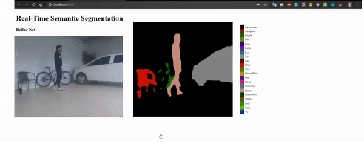

# Realtime instance segmentation in the browser

  

This project uses TensorFlow.js to perform realtime instance segmentation in the browser using [RefineNet](https://arxiv.org/pdf/1611.06612.pdf). Many thanks to @[Vladimir Nekrasov](https://drsleep.github.io/) that provided the *.js weights* of the [Light-Weight RefineNet](http://bmvc2018.org/contents/papers/0494.pdf) - a more compact implementation of RefineNet, suitable for tasks requiring real-time performance.

  
  
  
  

### Getting started

TODO
